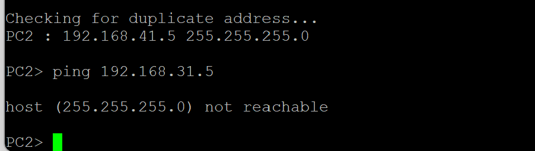

## 6. Laborübung

### 6.1. Übung 3 – VLANs programmieren und beobachten
Als klassische VLAN Aufgabe wird gerne die Aufteilung eines Netzwerkes für
verschiedene Abteilungen verwendet. Jede Abteilung erhält dafür ein eigenes
VLAN. Ihre Aufgabe besteht nun darin, dass Netzwerk in GNS3 aufzubauen, zu
konfigurieren und Messungen mit Wireshark durchzuführen.

#### 6.1.1. Lernziele

Sie sind in der Lage auf MikroTik Routern VLANs zu programmieren.
Sie können VLAN Tags mit Wireshark auslesen.

#### 6.1.2. Aufgabe
