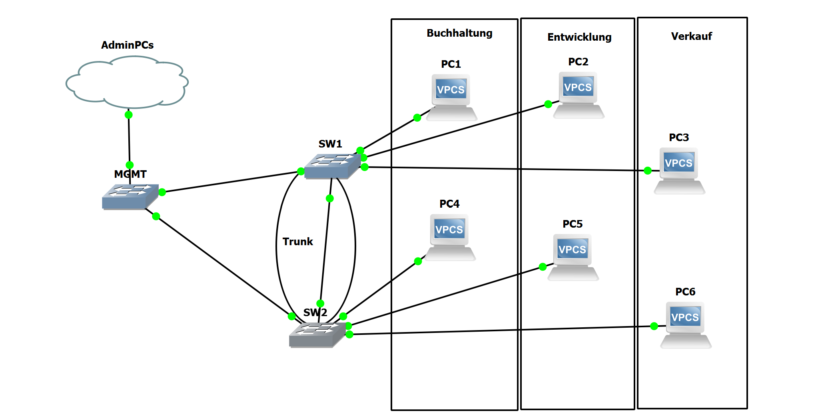
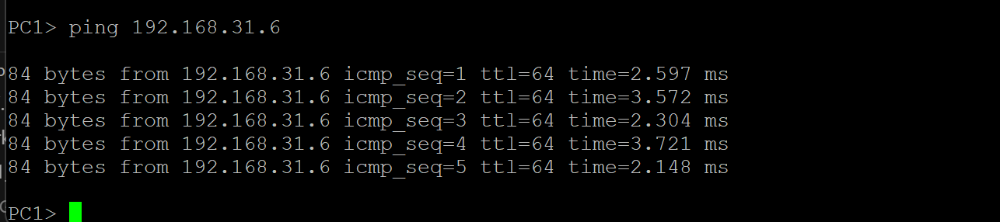
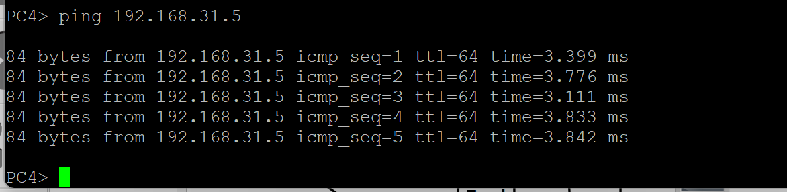

## 6. Laborübung

### 6.1. Übung 3 – VLANs programmieren und beobachten
Als klassische VLAN Aufgabe wird gerne die Aufteilung eines Netzwerkes für
verschiedene Abteilungen verwendet. Jede Abteilung erhält dafür ein eigenes
VLAN. Ihre Aufgabe besteht nun darin, dass Netzwerk in GNS3 aufzubauen, zu
konfigurieren und Messungen mit Wireshark durchzuführen.

#### 6.1.1. Lernziele

Sie sind in der Lage auf MikroTik Routern VLANs zu programmieren.
Sie können VLAN Tags mit Wireshark auslesen.


#### 6.1.2. Aufgabe


## Befehle:

### IPs vergeben

192.168.31.0/24
192.168.41.0/24
192.168.51.0/24

PC1: 192.168.31.5
PC2: 192.168.41.5
PC3: 192.168.51.5
PC4: 192.168.31.6
PC5: 192.168.41.6
PC6: 192.168.51.6

ip [IP Adresse] [Subnetz]

### Neue VLAN fähige Bridge hinzufügen
/interface bridge add name=[bridgename] protocol-mode=none vlan-filtering=yes
/interface bridge add name=bridge1 protocol-mode=none vlan-filtering=yes

### Einen Port (Only Untagged) zu einer Bridge hinzufügen (z.B. für ein Endgerät)
/interface bridge port add bridge=[bridgename] comment="VLAN [Nummer] – [Name Abteilung]" frame-types=admit-only-untagged-and-priority-tagged hw=no interface=[interface] pvid=[VLAN Nummer]
/interface bridge port add bridge=bridge1 comment="VLAN 101 – Buchhaltung" frame-types=admit-only-untagged-and-priority-tagged hw=no interface=ether4 pvid=101
/interface bridge port add bridge=bridge1 comment="VLAN 102 – Entwicklung" frame-types=admit-only-untagged-and-priority-tagged hw=no interface=ether5 pvid=102
/interface bridge port add bridge=bridge1 comment="VLAN 103 – Verkauf" frame-types=admit-only-untagged-and-priority-tagged hw=no interface=ether6 pvid=103

### Einen Port (Only Tagged) zu einer Bridge hinzufügen (z.B. als Trunk)
/interface bridge port add bridge=bridge1 frame-types=admit-only-vlan-tagged hw=no interface=ether8

### Ein VLAN einer Bridge hinzufügen, sowie «tagged» und «untagged» ports definieren. ( Dieser Befehl definiert, welche Ports getaggte und ungetaggte Frames für das VLAN mit der ID 103 senden und empfangen.)

```python
/interface bridge vlan add bridge=bridge1 comment="VLAN 101" tagged=ether8 untagged=ether4 vlan-ids=101
/interface bridge vlan add bridge=bridge1 comment="VLAN 102" tagged=ether8 untagged=ether5 vlan-ids=102
/interface bridge vlan add bridge=bridge1 comment="VLAN 103" tagged=ether8 untagged=ether6 vlan-ids=103
```

### Den Hostnamen / Namen des Gerätes setzen:
/system identity set name=[Name]
/system identity set name=SW1
/system identity set name=SW2

### PING Funktioniert:





Die Wireshark datei finden Sie hier:

[Wireshark_GNS3_VLAN](Wireshark_GNS3_VLAN.pcapng)

## 6.2. Übung 4 – Praxisnahes VLAN Beispiel mit Router und DHCP Server
In der Praxis erhält jedes VLAN ein eigenes Subnetz (Grundregeln: Ein Subnetz
pro VLAN), ein Default Gateway, einen DHCP Server. In dieser Aufgabe erweitern
Sie Ihr Netzwerk aus Übung 3 mit diesen Komponenten.

### 6.2.1. Lernziele

Sie können einen DHCP-Server konfigurieren.
Sie können einen DNS-Server konfigurieren.
Sie können einen Router für mehrere Subnetze konfigurieren.


### 6.2.2. Aufgabe


