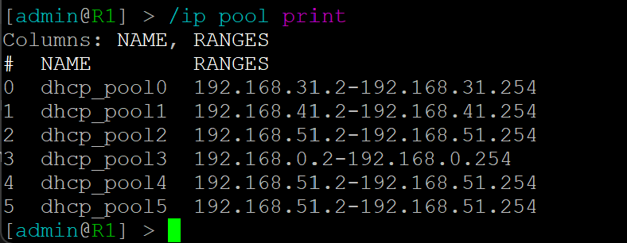

## 6. Laborübung

### 6.1. Übung 3 – VLANs programmieren und beobachten
Als klassische VLAN Aufgabe wird gerne die Aufteilung eines Netzwerkes für
verschiedene Abteilungen verwendet. Jede Abteilung erhält dafür ein eigenes
VLAN. Ihre Aufgabe besteht nun darin, dass Netzwerk in GNS3 aufzubauen, zu
konfigurieren und Messungen mit Wireshark durchzuführen.

#### 6.1.1. Lernziele

Sie sind in der Lage auf MikroTik Routern VLANs zu programmieren.
Sie können VLAN Tags mit Wireshark auslesen.


#### 6.1.2. Aufgabe


## Befehle:

### IPs vergeben

192.168.31.0/24  
192.168.41.0/24  
192.168.51.0/24  

PC1: 192.168.31.5  
PC2: 192.168.41.5  
PC3: 192.168.51.5  
PC4: 192.168.31.6  
PC5: 192.168.41.6  
PC6: 192.168.51.6  

ip [IP Adresse] [Subnetz]

### Neue VLAN fähige Bridge hinzufügen

```python
/interface bridge add name=bridge1 protocol-mode=none vlan-filtering=yes
```

### Einen Port (Only Untagged) zu einer Bridge hinzufügen (z.B. für ein Endgerät)
```python
/interface bridge port add bridge=bridge1 comment="VLAN 101 – Buchhaltung" frame-types=admit-only-untagged-and-priority-tagged hw=no interface=ether4 pvid=101
/interface bridge port add bridge=bridge1 comment="VLAN 102 – Entwicklung" frame-types=admit-only-untagged-and-priority-tagged hw=no interface=ether5 pvid=102
/interface bridge port add bridge=bridge1 comment="VLAN 103 – Verkauf" frame-types=admit-only-untagged-and-priority-tagged hw=no interface=ether6 pvid=103
```

### Einen Port (Only Tagged) zu einer Bridge hinzufügen (z.B. als Trunk)

```python
/interface bridge port add bridge=bridge1 frame-types=admit-only-vlan-tagged hw=no interface=ether8
```

### Ein VLAN einer Bridge hinzufügen, sowie «tagged» und «untagged» ports definieren. ( Dieser Befehl definiert, welche Ports getaggte und ungetaggte Frames für das VLAN mit der ID 103 senden und empfangen.)

```python
/interface bridge vlan add bridge=bridge1 comment="VLAN 101" tagged=ether8 untagged=ether4 vlan-ids=101
/interface bridge vlan add bridge=bridge1 comment="VLAN 102" tagged=ether8 untagged=ether5 vlan-ids=102
/interface bridge vlan add bridge=bridge1 comment="VLAN 103" tagged=ether8 untagged=ether6 vlan-ids=103
```

### Den Hostnamen / Namen des Gerätes setzen:
/system identity set name=[Name]
/system identity set name=SW1
/system identity set name=SW2

### PING Funktioniert:


Die Wireshark datei finden Sie hier:

[Wireshark_GNS3_VLAN](Wireshark_GNS3_VLAN.pcapng)

## 6.2. Übung 4 – Praxisnahes VLAN Beispiel mit Router und DHCP Server
In der Praxis erhält jedes VLAN ein eigenes Subnetz (Grundregeln: Ein Subnetz
pro VLAN), ein Default Gateway, einen DHCP Server. In dieser Aufgabe erweitern
Sie Ihr Netzwerk aus Übung 3 mit diesen Komponenten.

### 6.2.1. Lernziele

Sie können einen DHCP-Server konfigurieren.
Sie können einen DNS-Server konfigurieren.
Sie können einen Router für mehrere Subnetze konfigurieren.


### 6.2.2. Aufgabe


Die Subnetzmasken die ich verwendet habe:

192.168.31.0/24
192.168.41.0/24
192.168.51.0/24

Konfigurieren Sie auf dem Router die drei VLAN Interfaces. 
```python
/interface vlan add interface=ether2 vlan-id=101 name=ether2_vlan101
/interface vlan add interface=ether2 vlan-id=102 name=ether2_vlan102
/interface vlan add interface=ether2 vlan-id=203 name=ether2_vlan103
```

Geben Sie jedem VLAN interface eine praxisübliche Hostadresse.
```python
/ip address add address=192.168.31.1/24 interface=ether2_vlan101
/ip address add address=192.168.41.1/24 interface=ether2_vlan102
/ip address add address=192.168.51.1/24 interface=ether2_vlan103
```

Passen Sie SW1 an und fügen Sie ether2 als Tagged Port für die drei VLANs hinzu.
```python
/interface bridge vlan set numbers=0 tagged=ether8,ether2 untagged=ether4
/interface bridge vlan set numbers=1 tagged=ether8,ether2 untagged=ether5
/interface bridge vlan set numbers=2 tagged=ether8,ether2 untagged=ether6


/interface bridge port add bridge=bridge1 interface=ether2
/interface bridge vlan add bridge=bridge1 tagged=ether2 vlan-ids=101,102,103
```
DHCP Server für jedes Interface hinzufügen:

VLAN101:  
/ip dhcp-server setup  
ether2_vlan101  
192.168.31.0/24  
192.168.31.1  
192.168.31.2-192.168.31.254  
8.8.8.8  
2d  

VLAN102:  
/ip dhcp-server setup  
ether2_vlan102  
192.168.41.0/24  
192.168.41.1  
192.168.41.2-192.168.41.254  
8.8.8.8  
2d  

VLAN103:  
/ip dhcp-server setup  
ether2_vlan103  
192.168.51.0/24  
192.168.51.1  
192.168.51.2-192.168.51.254  
8.8.8.8  
2d  

/ip dhcp-server setup  
ehter1  
192.168.0.0/24  
192.168.0.1  
192.168.0.2-192.168.0.254  
Select DNS servers dns servers: 192.168.0.1  
2d  

DNS anpassen  
/ip dhcp-server network set [find address=192.168.65.0/24] dns-server=192.168.65.1

Ziele

Alle VPCS erhalten via DHCP eine IP-Adresse vom Router R1.
Die VPCS können den Router R1 anpingen.
Jede Abteilung hat ein eigenes /24 Subnetz.


[Wireshark](GNS3_VLAN_Aufgabe_6.2.2.pcapng)

## Probleme:

Der DHCP hat keine IP Adressen an PC3 und PC6 zugewiesen. Beide sind vom VLAN103.

Ich habe mir nochmals die Konfigurationen angeschaut. Mir ist aufgefallen, dass der DHCP für VLAN103 zweimal existierte. Ich habe den fehlerhaften dhcp entfernt.


Jedoch ging der DHCP immernoch nicht. Ich habe weiter geschaut und mit dem Befehl "/ip pool print" gesehen, dass auch hier 3mal die gleiche range auf 3 verschiedenen DHCP pools verteilt war.



Diese habe ich auch entfernt.


Ich musste dann noch mit dem Befehl "/ip dhcp-server print without paging kontrollieren ob jetzt der richtige pool zugewiesen wurde. Dies war nicht der fall es stand *6 drauf. dies habe ich so geändert das der richtige pool angegeben wurde. Der Befehl ist im screenshot ersichtlich.


ich habe es schlussendlich noch einmal versucht und es ging danach leider immernoch nicht. 