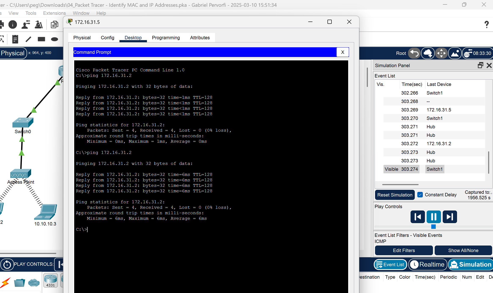
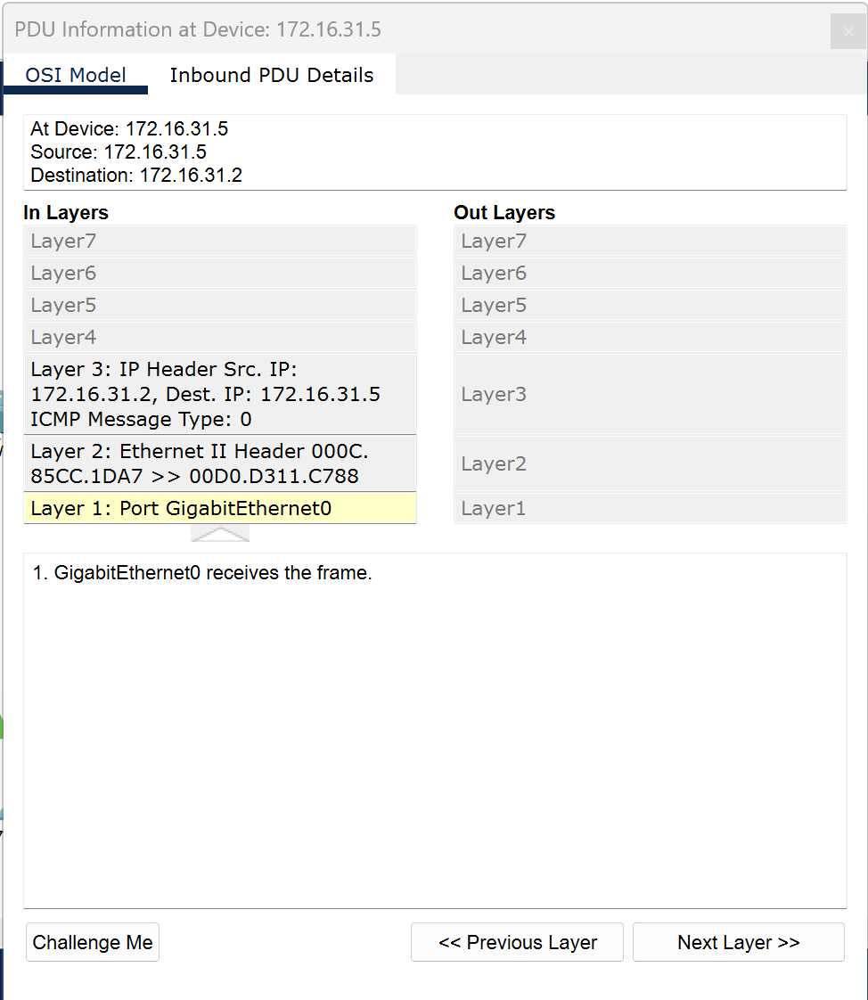

# M145

**Aufgaben Cisco Packet Tracer**

**02:**

How many Fast Ethernet interfaces does the switch have?

24 FastEhternet interfaces
How many Gigabit Ethernet interfaces 

does the switch have?
2 Gigabit Ethernet

What is the range of values shown for the vty lines?
line vty 0 4
line vty 5 15
range of 0-15

**04:**

| Feld              | Wert              |
|-------------------|------------------|
| Destination MAC  | 000C:85CC:1DA7   |
| Source MAC       | 00D0:D311:C788   |
| Source IP        | 172.16.31.5      |
| Destination IP   | 172.16.31.2      |

