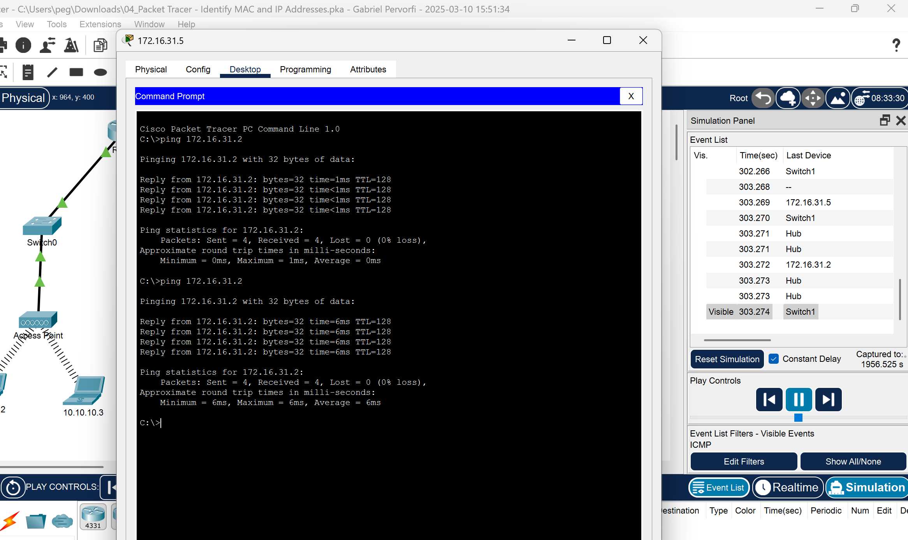

# M145 – Cisco Packet Tracer Aufgaben

Dieses Repository enthält Aufgaben und Analysen zu Cisco Packet Tracer im Rahmen von M145.

---

## **02: Switch Interfaces und VTY-Linien**

### **Switch Interfaces**
- **Fast Ethernet Interfaces:** 24  
- **Gigabit Ethernet Interfaces:** 2  

### **VTY-Linienbereich**
- `line vty 0 4`
- `line vty 5 15`  
  **→ Gesamtbereich:** `0-15`

---

## **04: Paketflussanalyse**

### **Screenshot 1 – Paketdetails**

| Feld              | Wert              |
|-------------------|------------------|
| **Destination MAC**  | 000C:85CC:1DA7   |
| **Source MAC**       | 00D0:D311:C788   |
| **Source IP**        | 172.16.31.5      |
| **Destination IP**   | 172.16.31.2      |

---

### **Screenshot 2 – Paketweiterleitung durch das Netzwerk**

| Gerät          | Destination MAC  | Source MAC      | Source IP     | Destination IP  |
|---------------|----------------|---------------|--------------|--------------|
| **172.16.31.5** | 000C:85CC:1DA7  | 00D0:D311:C788 | 172.16.31.5 | 172.16.31.2 |
| **Switch1**     | 000C:85CC:1DA7  | 00D0:D311:C788 | 172.16.31.5 | 172.16.31.2 |
| **Hub**        | N/A             | N/A           | 172.16.31.5 | 172.16.31.2 |
| **172.16.31.2** | 00D0:D311:C788  | 000C:85CC:1DA7 | 172.16.31.2 | 172.16.31.5 |
| **Router**     | 000C:85CC:1DA7  | 00D0:D311:C788 | 172.16.31.5 | 172.16.31.2 |

---

### **Erklärung der Paketweiterleitung**
1. **Gerät 172.16.31.5** sendet das Paket mit **Source MAC 00D0:D311:C788** und **Destination MAC 000C:85CC:1DA7** an 172.16.31.2.
2. **Switch1** empfängt das Paket und leitet es anhand der MAC-Tabelle weiter.
3. Falls ein **Hub** im Netzwerk wäre, würde er das Paket an alle Ports weiterleiten.
4. **Gerät 172.16.31.2** empfängt das Paket und antwortet mit vertauschten MAC- und IP-Adressen.
5. Falls eine **Router-Weiterleitung** erforderlich wäre, würde der Router das Paket weiterleiten.

---

📌 **Hinweis:** Falls dir die Darstellung gefällt oder du Verbesserungsvorschläge hast, kannst du gerne ein Issue eröffnen oder einen Pull Request stellen! 🚀  
